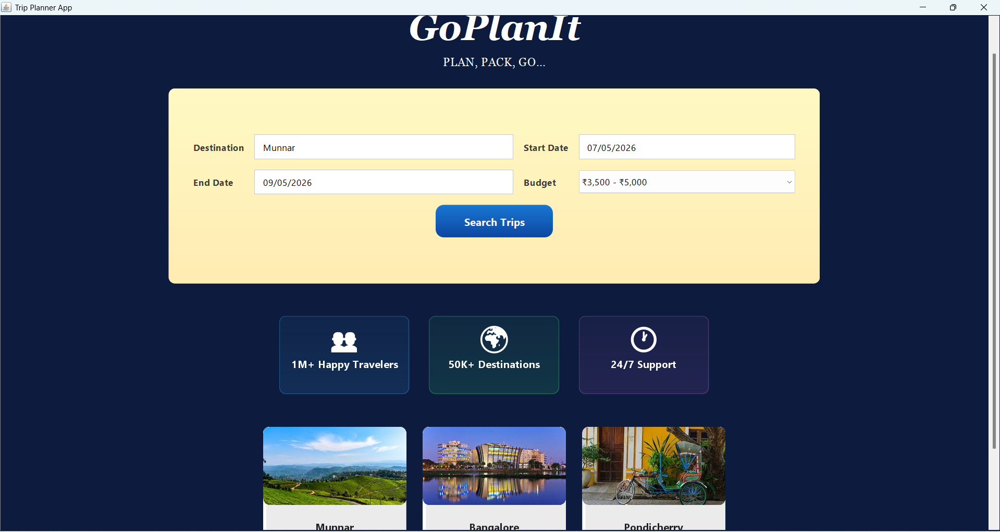
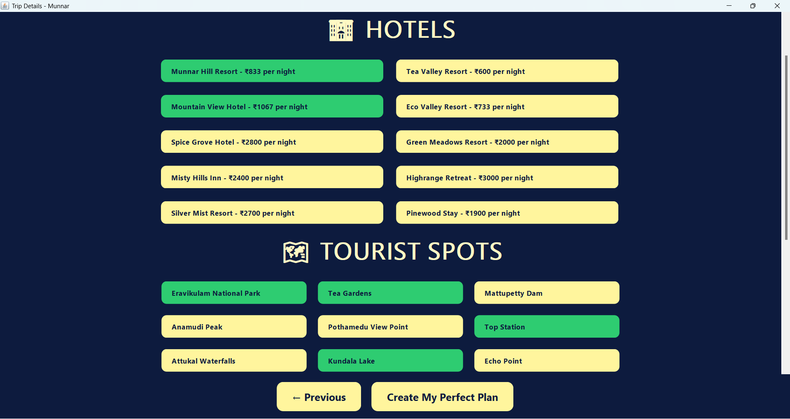
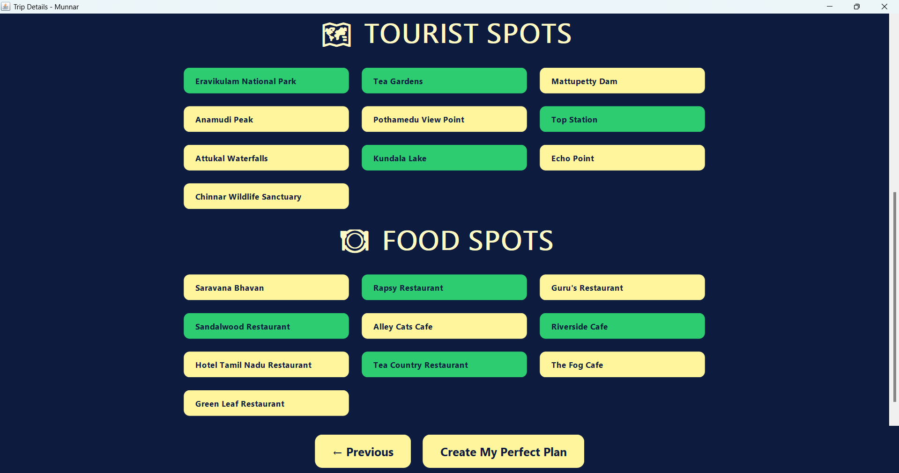
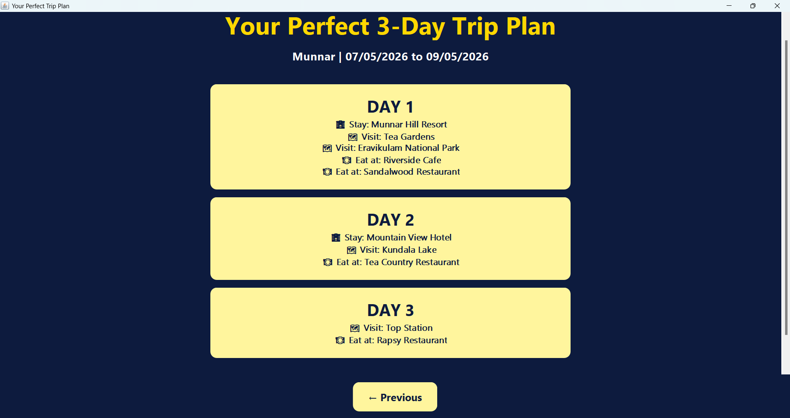

# Trip Planner Application

A Java Swing GUI application for trip planning with MySQL database integration.

## Project Structure

```
goplanit/
 ├── src/ # Java source files
 ├── database/ # SQL scripts
 ├── data/ # JSON files (if any)
 ├── scripts/ # Run & compile scripts
 ├── docs/ # Additional documentation
 ├── lib/ # External libraries (MySQL connector)
 ├── README.md

## Prerequisites

1. **Java Development Kit (JDK)** - Version 8 or higher
2. **MySQL Server** - Running locally on port 3306
3. **VS Code** with Java Extension Pack installed

## Database Setup

### ✅ AUTOMATIC SETUP (Recommended)

The application now automatically creates the database, tables, and populates sample data on first run!

**Just make sure:**
1. MySQL Server is running on localhost:your_id
2. Username: `root`, Password: `your_password` (or update in `DatabaseConnection.java`)
3. Run the application - database will be created automatically!

### Manual Setup (Optional)

If you prefer manual setup or automatic setup fails, you can manually create the database:

```sql
CREATE DATABASE trip_planner;
USE trip_planner;

CREATE TABLE hotels (
    id INT AUTO_INCREMENT PRIMARY KEY,
    name VARCHAR(255) NOT NULL,
    destination VARCHAR(255) NOT NULL,
    price_per_night DECIMAL(10,2) NOT NULL
);

CREATE TABLE tourist_spots (
    id INT AUTO_INCREMENT PRIMARY KEY,
    name VARCHAR(255) NOT NULL,
    destination VARCHAR(255) NOT NULL
);

CREATE TABLE food_spots (
    id INT AUTO_INCREMENT PRIMARY KEY,
    name VARCHAR(255) NOT NULL,
    destination VARCHAR(255) NOT NULL
);

-- Sample data
INSERT INTO hotels (name, destination, price_per_night) VALUES
('Hotel Paradise', 'Munnar', 2500.00),
('Green Valley Resort', 'Munnar', 3200.00),
('City Center Hotel', 'Bangalore', 3000.00),
('Tech Hub Inn', 'Bangalore', 2800.00),
('Beach View Resort', 'Pondicherry', 3500.00),
('French Quarter Hotel', 'Pondicherry', 4000.00);

INSERT INTO tourist_spots (name, destination) VALUES
('Tea Gardens', 'Munnar'),
('Eravikulam National Park', 'Munnar'),
('Lalbagh Botanical Garden', 'Bangalore'),
('Bangalore Palace', 'Bangalore'),
('Promenade Beach', 'Pondicherry'),
('Auroville', 'Pondicherry');

INSERT INTO food_spots (name, destination) VALUES
('Spice Garden Restaurant', 'Munnar'),
('Hill View Cafe', 'Munnar'),
('MTR Restaurant', 'Bangalore'),
('Koshy\'s Restaurant', 'Bangalore'),
('Cafe des Arts', 'Pondicherry'),
('Villa Shanti', 'Pondicherry');
```

3. Update database credentials in `DatabaseConnection.java` if needed:
   - URL: `jdbc:mysql://localhost:3306/trip_planner`
   - Username: `root` (change if different)
   - Password: `harithaishu` (change to your MySQL password)

**Note:** The application includes `DatabaseInitializer.java` which automatically handles database setup!

## How to Run in VS Code

### Method 1: Using VS Code Run Configuration (Recommended)

1. Open the project folder in VS Code
2. Press `F5` or go to **Run → Start Debugging**
3. Select "Run TripPlannerApp" from the configuration dropdown
4. The application will compile and run automatically

### Method 2: Using VS Code Tasks

1. Open Command Palette (`Ctrl+Shift+P`)
2. Type "Tasks: Run Task"
3. Select "compile-java" to compile
4. Then select "run-trip-planner" to run

### Method 3: Using Terminal in VS Code

1. Open integrated terminal (`Ctrl+` `)
2. Run compilation:
   ```bash
   javac -cp ".;lib/mysql-connector-j-9.4.0.jar" *.java
   ```
3. Run the application:
   ```bash
   java -cp ".;lib/mysql-connector-j-9.4.0.jar" TripPlannerApp
   ```

### Method 4: Using Batch Files (Windows)

1. Double-click `run.bat` to compile and run
2. Or double-click `compile.bat` to just compile

### Method 5: Using PowerShell Script

1. Right-click `run.ps1` and select "Run with PowerShell"
2. Or in PowerShell terminal: `.\run.ps1`

## Features

- **Modern GUI**: Beautiful gradient backgrounds and rounded components
- **Database Integration**: Connects to MySQL database for real data
- **Trip Search**: Search for destinations and get detailed information
- **Hotel Listings**: View available hotels with pricing
- **Tourist Spots**: Discover popular tourist attractions
- **Food Recommendations**: Find local food spots and restaurants
- ## 📸 Screenshots

### 🏠 Home Screen  


### 🔍 Search Results  
  


### 🗺️ Final Trip Plan  


## Troubleshooting

### Common Issues

1. **MySQL Connection Error**: 
   - Ensure MySQL server is running
   - Check database credentials in `DatabaseConnection.java`
   - Verify database and tables exist

2. **ClassNotFoundException**:
   - Ensure `mysql-connector-j-9.4.0.jar` is in the `lib` folder
   - Check classpath configuration

3. **Compilation Errors**:
   - Ensure JDK is properly installed and in PATH
   - Check that all Java files are in the correct location

### Getting Full Output

To see complete console output and error messages:

1. **In VS Code**: Use the integrated terminal or debug console
2. **Command Line**: Run from Command Prompt or PowerShell
3. **Check Logs**: Look at the VS Code Output panel (View → Output)

## Development

- **Main Class**: `TripPlannerApp` - Contains the main GUI
- **Database Layer**: `DatabaseConnection` and `TripDataFetcher`
- **Results Window**: `TripResultsWindow` - Shows search results
- **Styling**: Custom Swing components for modern UI

## License

This project is for educational purposes.

